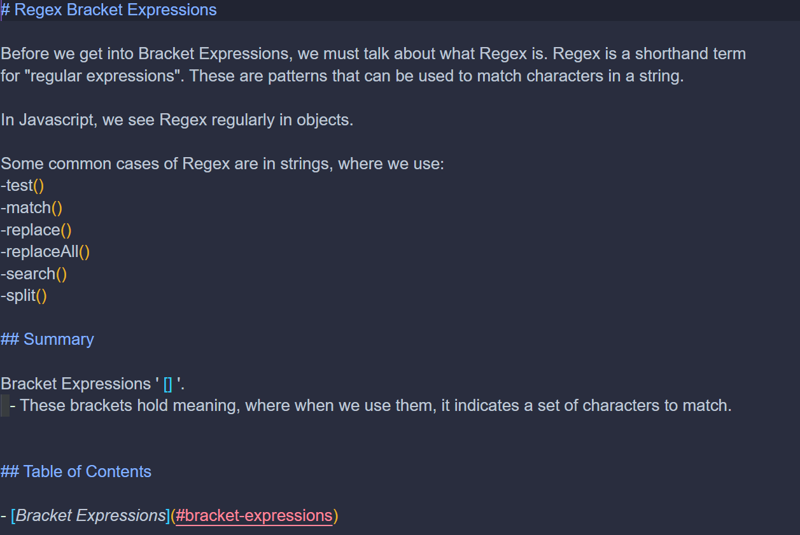
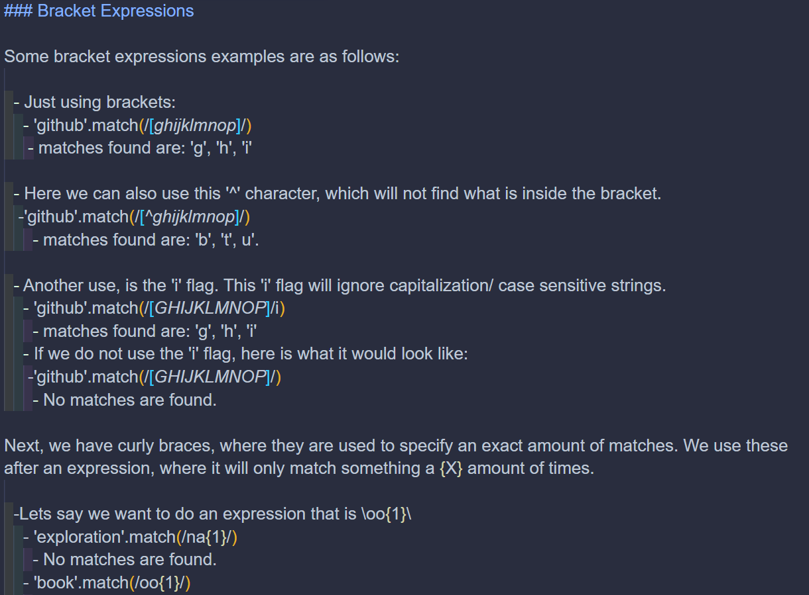
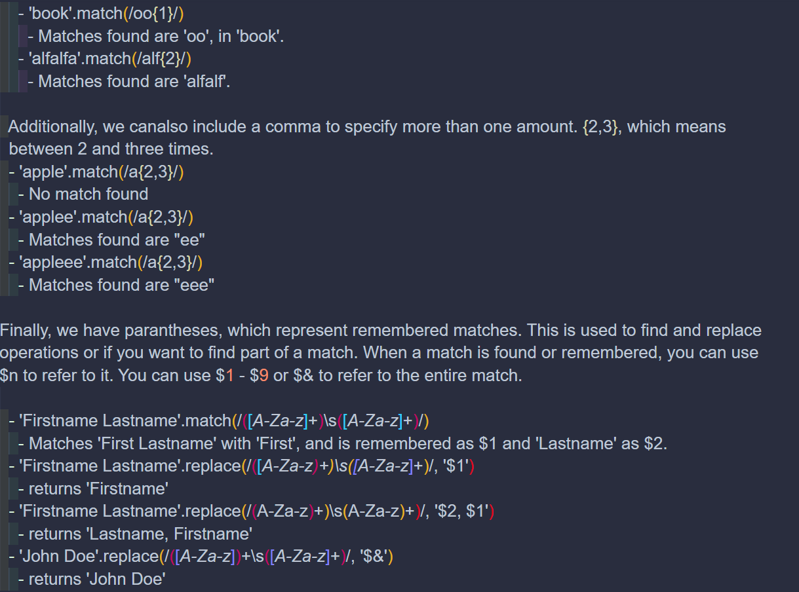

# REGEX-Bracket-Expression-Tutorial

## Description

I created this Regex Bracket Expression tutorial in order to help myself and others understand different types of bracket expressions.

## Usage

Users can read the gist-Regex-Bracket-Expression.md page, which will go into depth about the different types of bracket expressions in JavaScript. You can also look at the images provided below:

    ```md
    
    ```

        ```md
    
    ```

        ```md
    
    ```

## Credits

IBM Documentation on Bracket Expressions

https://www.ibm.com/docs/it/netcoolomnibus/7.4?topic=library-bracket-expressions

## License

No license, anyone can use this or contribute!